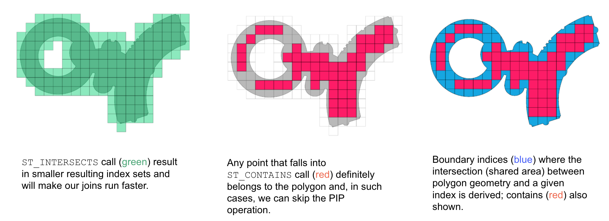
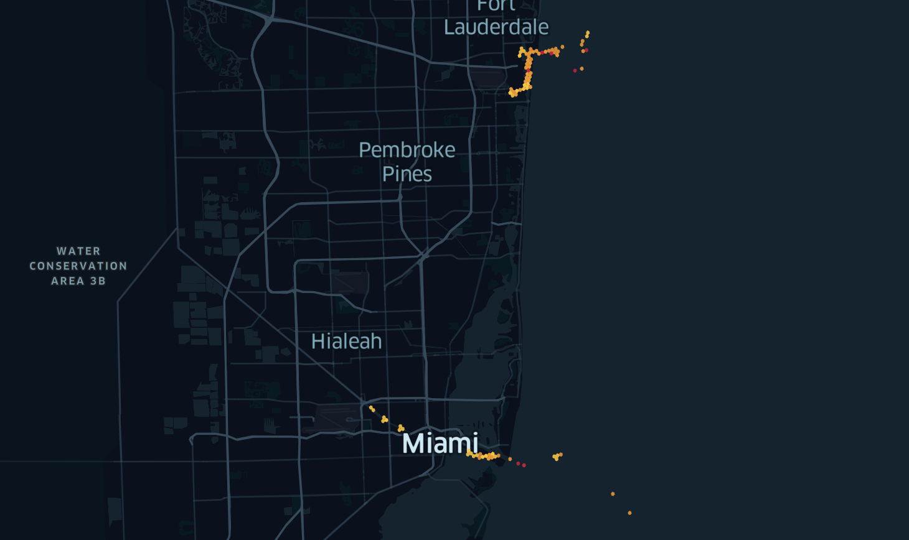
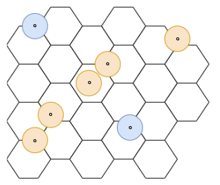
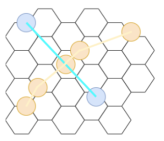
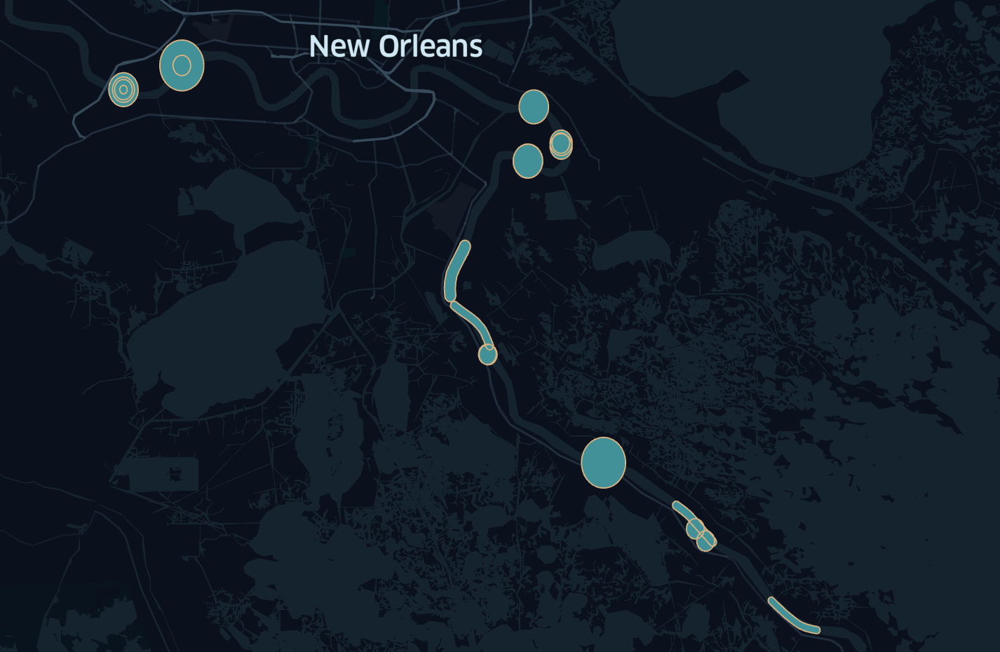
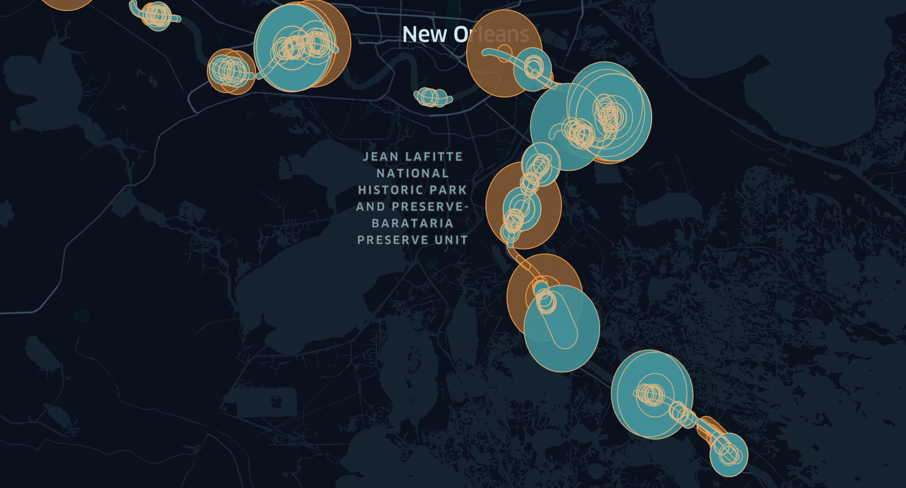
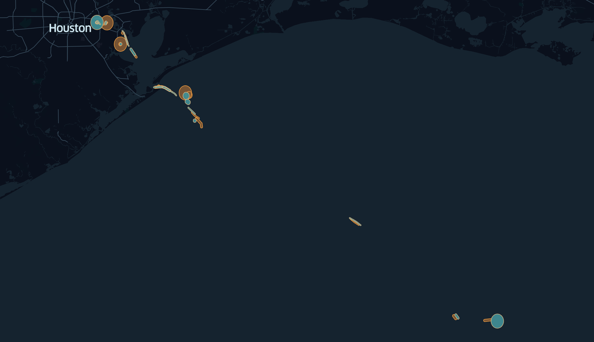

# Ship to Ship Transfer Detection

## Introduction
In a world full of embargoes and barriers to trade, there will always be actors that try to circumvent these blocks. At sea, these can take the form of [STS (Ship to Ship) transfers](https://en.wikipedia.org/wiki/Ship-to-ship_cargo_transfer). Historically, identifying these events in the data is generally a bespoke process, undertaken on a case-by-case basis by the regulators to study particular vessels or areas of interest.

Nowadays, by leveraging scalable cloud infrastructure and big data processing technologies like [Apache Spark](https://spark.apache.org/), these analyses can move from a reactive approach to a pro-active one; regulators can shift to actively monitor marine activity, highlight and investigate potentially illegal STS transfers.

This blog  will cover two approaches to STS transfer detection; starting with an event-based approach, and following up with an advanced aggregate approach. We will also discuss ways to optimise this with [Mosaic](https://databrickslabs.github.io/mosaic/) on Databricks. This content was presented at the [Data and AI Summit 2022](https://www.youtube.com/watch?v=XQNflqbgP7Q).

## Data Ingestion

For the purpose of this analysis we will be leveraging Vessel traffic data, or Automatic Identification System (AIS) data, collected by the US Coast Guard. This data contains information such as timestamps, locations, speeds and ship types. 

For the purpose of this analysis we will be leveraging Vessel traffic data, or [Automatic Identification System (AIS)](https://en.wikipedia.org/wiki/Automatic_identification_system) data, collected by the US Coast Guard. This data contains information such as timestamps, locations, speeds and ship types.

Raw positional data does not have any native geometrical concepts. Positions are represented via longitude and latitude columns. To work with this data at scale, and leverage Mosaic, we can transform these longitudes and latitudes into a geometric representation as follows:

```python
display(
  cargos
  .withColumn("point_geom",st_astext(st_point("LON", "LAT")))
)
```

In this case, displaying it out to WKT so we can easily interpret it visually. Please note that the advised format for storage is WKB (`st_asbinary`), the reasons being two-fold, firstly, WKB is a lossless format, secondly each geometry will have a smaller runtime memory footprint. We use WKT simply for displayability during the development stages and for discussion purposes.

However, proximity joins in spark are very costly if applied naively commonly resulting in cartesian or near-cartesian complexity joins. To really enable processing of this data at scale, we will leverage H3 indices to sit alongside our geometries. By using an index, we can simplify and drastically limit the number of geospatial operations that need to be performed. Picking the exact resolution at which to index will depend on your use case. Choosing a resolution too small or too large will reduce the overall effectiveness of your index. For the purpose of this exercise, we will choose resolution 9 which has an average hexagon edge length of 173 metres.

```python
cargos_indexed = (
  cargos
  .withColumn('ix', point_index_lonlat("LON", "LAT", lit(9)))
)
```

Before we conduct any analysis, we will write out our indexed spark dataframe to a [delta](https://delta.io/) to colocate related information in the same set of files, which will drastically improve our ability to process very large volumes of geospatial data. 

As aforementioned, storing our geometry itself is more efficient as a WKB than a WKT, so we will convert it accordingly.

```python
(
  cargos_indexed
   .withColumn('point_geom', st_aswkb('point_geom'))
   .write
   .mode('overwrite')
   .saveAsTable("cargos_indexed')
)
spark.sql("OPTIMIZE cargos_indexed ZORDER by (ix, BaseDateTime)")
```

## Algorithm 1: Isolated Pings
Once the data has been indexed and optimally stored as a ZORDERed delta table, we are ready to process it and attempt to detect potential transfers.

A first pass, and common implementation, is comparing pings across two dimensions, time and space, and flagging potential overlaps as potential transfers. These can feed into a larger risk or detection model.

Without leveraging indices, this would mean calculating the distance between every pair of pings – an expensive and time-consuming operation. While we could optimise this operation by leveraging indices, a simply join on the index would not suffice since two ships could be within the threshold distance but along the edge of two different H3 indices.


Instead, what we will do is to create a buffer around every ping of roughly 100 metres. This converts our point to a circle. If two circles overlap each other, we know that the two pings, or ships, are within close proximity of each other.

Firstly, we create the buffer around the points to create our polygons, and then break up our polygon into the smaller constituent parts – the chips, that form the larger mosaic, if you will. By taking this approach, we can drastically simplify our operation to see if there is any overlap between polygons.

```python
# Given our projection is in decimal degrees, we define our buffer in those terms
one_metre = (0.00001 - 	0.000001)
buffer = 100 * one_metre 

(
  cargos_indexed
  .withColumn('buffer_geom', st_buffer("point_geom", lit(buffer)))
  .withColumn("ix", mosaic_explode("buffer_geom", lit(9)))
  .write
  .mode('overwrite')
  .saveAsTable('cargos_buffered')
)
spark.sql("OPTIMIZE cargos_buffered ZORDER BY (ix.index_id, BaseDateTime)")
```


We can now implement our final algorithm to construct a list of overlaps in time and space. To do this efficiently, we leverage a property of our mosaic chips. When we created the chips, if an index was fully contained within our polygon, it was classified as a core index, and the value `ix.is_core` was set to true. In cases where we are dealing with a core index, no geospatial calculation is required, as every point that might fall within that index, or any shape that falls within that index, would inherently overlap with our core index. This gives us a shortcut that avoids further geospatial computations.




Below, you will see this implemented in our where clause, where, if either side compares across a core index, there is no need to call `ST_INTERSECTS`. 

In the cases where it is necessary to compare the actual polygons, this comparison happens across a simplified shape of just the small chip of the larger polygon–making the underlying calculation much simpler.

Beyond the spatial dimension, we also want to take time into account. Thus, we indicate that we only wish to compare pings that happen within a certain time window. We calculate that time window dynamically based on the speed and heading of the vessels.

```python
def time_window(sog1, sog2, heading1, heading2, radius):
    """Create dynamic time window based on speed, buffer radius and heading.

    Args:
        sog1 (double): vessel 1's speed over ground, in knots
        sog2 (double): vessel 2's speed over ground, in knots
        heading1 (double): vessel 1's heading angle in degrees
        heading2 (double): vessel 2's heading angle in degrees
        radius (double): buffer radius in degrees

    Returns:
        double: dynamic time window in seconds based on the speed and radius
    """
    v_x1 = col(sog1) * cos(col(heading1))
    v_y1 = col(sog1) * sin(col(heading1))
    v_x2 = col(sog2) * cos(col(heading2))
    v_y2 = col(sog2) * sin(col(heading2))

    # compute relative vectors speed based on x and y partial speeds
    v_relative = sqrt((v_x1 + v_x2) * (v_x1 + v_x2) + (v_y1 + v_y2) * (v_y1 + v_y2))
    # convert to m/s and determine ratio between speed and radius
    return v_relative * lit(1000) / lit(radius) / lit(3600)

candidates = (
    buffered_events.alias("a")
    .join(
        buffered_events.alias("b"),
        [
            # to only compare across efficient indices
            col("a.ix.index_id") == col("b.ix.index_id"), 
            # to prevent comparing candidates bidirectionally
            col("a.mmsi") < col("b.mmsi"),
            # to only compare across pings that happened around the same time
            ts_diff("a.BaseDateTime", "b.BaseDateTime")
            < time_window("a.sog_kmph", "b.sog_kmph", "a.heading", "b.heading", buffer),
        ],
    )
    .where(
        (
            # if either candidate fully covers an index, no further comparison is needed
            col("a.ix.is_core") | col("b.ix.is_core")
        )  # limit geospatial querying to cases where indices are not enough
        | mos.st_intersects(
            "a.ix.wkb", "b.ix.wkb"
        )  
    )
    .select(
        col("a.vesselName").alias("vessel_1"),
        col("b.vesselName").alias("vessel_2"),
        col("a.BaseDateTime").alias("timestamp_1"),
        col("b.BaseDateTime").alias("timestamp_2"),
        col("a.ix.index_id").alias("ix"),
    )
)
```

This gives us a table that shows us all the combinations of vessels that were within close proximity of each other, and the indices where these potential overlaps took place. Since most of these calculations did not require strict geospatial comparisons, but could rather be evaluated through their indices, this drastically reduced the time needed to process this operation.

For visual inspection of some of these locations, we can also leverage Mosaic. We can create a temporary view with the most commonly occurring indices to indicate potential hotspots.

```sql
%sql
CREATE OR REPLACE TEMPORARY VIEW agg_overlap AS
SELECT ix, count(*) AS count
FROM overlap_candidates 
GROUP BY ix 
ORDER BY count DESC 
LIMIT 1000
```

And then view the output by leveraging the mosaic kepler visualisation:
```python
%%mosaic_kepler
"agg_overlap" "ix" "h3"
```


Whilst the algorithm 1 approach is a dramatic improvement of bespoke, reactive implementations, there are still limitations to this implementation. The following section will show a way of iterating over this approach to find additional candidates.

## Algorithm 2: Aggregations

When comparing the previous implementations, there is a potential gap that is not explored. Take the following example of sets of pings from two vessels:



Under our current approach we would not see any potential crossing between these vessels. However, if we take into account that these pings define the path of the ship, we see that this does provide us with an intersection of their paths:



By aggregating the points into linestrings we find a way to represent the data that includes additional information.

To aggregate our points into lines, we collect the pings over 15 minute windows.

```python
lines = (
    cargos_indexed.repartition(sc.defaultParallelism * 20)
    .groupBy("mmsi", window("BaseDateTime", "15 minutes"))
    # We link the points to their respective timestamps in the aggregation
    .agg(collect_list(struct(col("point_geom"), col("BaseDateTime"))).alias("coords"))
    # And then sort our array of points by the timestamp
    .withColumn(
        "coords",
        expr(
            """
        array_sort(coords, (left, right) -> 
            case 
            when left.BaseDateTime < right.BaseDateTime then -1 
            when left.BaseDateTime > right.BaseDateTime then 1 
            else 0 
            end
        )"""
        ),
    )
    .withColumn("line", mos.st_makeline(col("coords.point_geom")))
)
```

This has the added benefit of reducing the total number of records, and therefore shapes, we are comparing.

We then buffer our linestring dynamically to account for a degree of uncertainty in the instance of fewer pings. The way we define uncertainty is as a reverse proxy to speed of movement. The intuition behind this choice is held in the way AIS positions are emitted. The faster the vessel moves the more positions it will emit - yielding a smoother trajectory, where slower vessels will yield far fewer positions and a harder to reconstruct trajectory which inherently holds more uncertainty.

```python
cargo_movement = (
    lines.withColumn("buffer_r", get_buffer("line"))
    .withColumn("buffer_geom", mos.st_buffer("line", col("buffer_r")))
    .withColumn("buffer", mos.st_astext("buffer_geom"))
    .withColumn("ix", mos.mosaic_explode("buffer_geom", lit(9)))
)
```

This produces the following types of shapes to compare:



When we join these together, again leveraging Mosaic optimisations, we can produce all candidates. This time, instead of a dynamic time difference, we join across the time window. 

```python
candidates_lines = (
    cargo_movement.alias("a")
    .join(
        cargo_movement.alias("b"),
        [
            col("a.ix.index_id") == col("b.ix.index_id"),
            col("a.mmsi") < col("b.mmsi"),
            col("a.window") == col("b.window"),
        ],
    )
    .where(
        (col("a.ix.is_core") | col("b.ix.is_core"))
        | mos.st_intersects("a.ix.wkb", "b.ix.wkb")
    )
    .select(
        col("a.mmsi").alias("vessel_1"),
        col("b.mmsi").alias("vessel_2"),
        col("a.window").alias("window"),
        col("a.buffer").alias("line_1"),
        col("b.buffer").alias("line_2"),
        col("a.ix.index_id").alias("index"),
    )
)
```

When we plot the results, we see that this produces great insights into where we see overlapping routes.



## Extension: Disregarding Harbours

One thing that does become apparent when we analyse our current implementation is that the most potential STS transfers occur in or around harbours. We can reasonably expect these to be instances of normal docking procedures, rather than STS transfers. Their noise is hiding much of the rest of our data.

As such, we will want to filter out this noise. To facilitate this, we loaded all major US ports into a table, buffered a large area around them and indexed them with H3. The results we stored in a table `harbours_h3`.

We can then use an anti-join to limit the results to those that occur away from harbours and plot some sample ship paths.

```python
matches = (
    candidates_lines.join(
        harbours_h3, 
        how="leftouter", 
        on=candidates_lines["index"] == harbours_h3["h3"]
    )
    .where(harbours_h3["h3"].isNull())
    .groupBy("vessel_1", "vessel_2")
    .agg(first("line_1").alias("line_1"), first("line_2").alias("line_2"))
)
```

This yields interesting results, including potential STS transfers farther out at sea:




Additional extensions can be made in a similar fashion to extend the scope. For instance, if we had a datasource with ship dimensions we could take these into account. One could dynamically define areas of interest (ie buffers) based on ship dimensions - larger the ship, larger the buffer. This is just one of possible extensions of the outlined approach and there are many more.

The approach outlined in this blog can fundamentally change the detection of unauthorised STS transfers from a reactionary, bespoke, and manual analysis to a proactive one that takes place automatically, at scale, and can include advanced risk models to flag and alert upon registering anomalies.